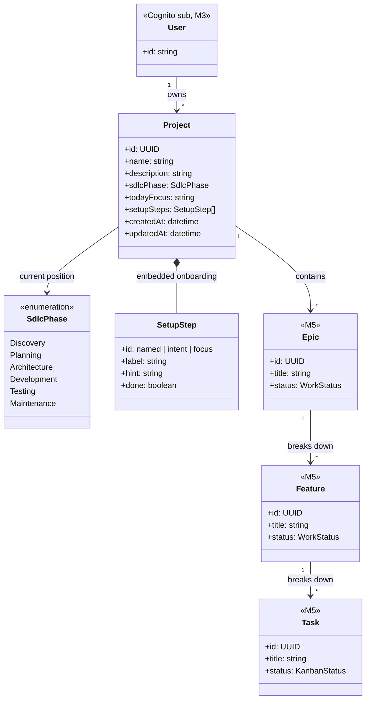

# Data model (domain)

Conceptual model for DevOS — **what entities exist**, how they relate, and how that maps to **SDLC**, **HTTP APIs**, and **DynamoDB**. This is the “class diagram / ER” layer; it is not SQL migrations or Prisma.

**Related**

| Topic | Doc |
| --- | --- |
| Product hierarchy (one line) | [architecture.md](./architecture.md) |
| SDLC rules on projects | [sdlc-ux.md](./sdlc-ux.md) |
| Projects REST + JSON shapes | [api-projects.md](./api-projects.md), [api/openapi.yaml](./api/openapi.yaml) |
| TypeScript types (implemented) | `packages/domain` |
| DynamoDB keys & access patterns | [aws-dev-workflow.md](./aws-dev-workflow.md#dynamodb-sketch-projects-mvp) |
| Local DynamoDB | [dynamodb-local.md](./dynamodb-local.md) |

---

## Scope legend

| Status | Meaning |
| --- | --- |
| **Implemented** | In `@dev-os/domain`, API contract, MSW; persistence in progress (M2) |
| **Specified** | Described here + MVP docs; API/Dynamo not built yet |
| **Post-MVP** | [future.md](./future.md) only |

---

## Conceptual class diagram (MVP target)

Solo developer product: **one User owns many Projects**; each Project has a **current SDLC phase** and **work items** scoped to that project. Phases are an ordered path, not a separate table in MVP.



**Note:** `SetupStep` is **derived** from project fields (`name`, `description`, `todayFocus`) via domain helpers — not a separate persisted entity in MVP.

---

## SDLC in the model

The SDLC is **not** a free-floating diagram in the database. In MVP it is:

1. **`Project.sdlcPhase`** — where the project is on the shared path ([sdlc-ux.md](./sdlc-ux.md)).
2. **`SetupStep[]`** — Discovery-oriented **onboarding** inside the project (not the full lifecycle wizard).
3. **Later (M6)** — phase map UI, soft transitions, micro-steps (may add fields or related records; still TBD in API).
4. **Work items (M5)** — Epics / Features / Tasks live **under the project**, interpreted in the context of the **current phase** (Kanban).

```text
Discovery → Planning → Architecture → Development → Testing → Maintenance
              ↑
         Project.sdlcPhase (single current value per project)
```

Create rule: new `Project` always starts with `sdlcPhase = Discovery` (server-enforced).

---

## Entity reference

### User — *Specified (M3)*

| | |
| --- | --- |
| **Identity** | Amazon Cognito `sub` (JWT); no DevOS “users table” in MVP |
| **Relationships** | 1 → N `Project` (ownership enforced in Lambda) |
| **Persistence** | Appears in DynamoDB as **`USER#<sub>`** partition key after M3 |

### Project — *Implemented (domain + API); persistence M2*

| Attribute | Type | Notes |
| --- | --- | --- |
| `id` | UUID | Generated on create |
| `name` | string | Required |
| `description` | string | Discovery intent |
| `sdlcPhase` | `SdlcPhase` | Always `Discovery` on create |
| `todayFocus` | string | Kaizen / weekly focus |
| `setupSteps` | `SetupStep[]` | Usually derived on server |
| `createdAt` / `updatedAt` | ISO datetime | |

### SetupStep — *Implemented (embedded)*

Onboarding checklist; see `createSetupSteps` in `packages/domain`.

### Epic → Feature → Task — *Specified (M5)*

| Level | Role |
| --- | --- |
| **Epic** | Large outcome within a project |
| **Feature** | Deliverable chunk under an epic |
| **Task** | Kanban card; status workflow |

API and Dynamo patterns will be added with `docs/api-work.md` (not written yet). Expect **project-scoped** keys, e.g. items under `PROJECT#<id>` with distinct SK prefixes (`EPIC#`, `FEATURE#`, `TASK#`) — sketch when M5 starts.

### AI context — *Specified (M7)*

No separate “AI message” entity in MVP data model doc yet; companion reads **aggregated** project + work + phase context at request time.

---

## ER view (relationships only)

```text
┌─────────┐       owns        ┌───────────┐
│  User   │ 1 ────────────── * │  Project  │
└─────────┘                   └─────┬─────┘
                                    │ 1
                    ┌───────────────┼───────────────┐
                    │ has phase     │ contains      │
                    ▼               ▼               │
              SdlcPhase      SetupStep[] (embedded) │
                    │               │               │
                    │               │         ┌─────┴─────┐
                    │               │         │   Epic    │ * (M5)
                    │               │         └─────┬─────┘
                    │               │               │ 1
                    │               │         ┌─────▼─────┐
                    │               │         │  Feature  │ *
                    │               │         └─────┬─────┘
                    │               │               │ 1
                    │               │         ┌─────▼─────┐
                    │               │         │   Task    │ *
                    │               │         └───────────┘
```

---

## Physical tables in AWS (will it stay this slim?)

**Logical model** (many classes: Project, Epic, Task, …) will **grow** — see [mvp.md](./mvp.md) and the class diagram above.

**Physical DynamoDB layout** for DevOS is intentionally **slim on table count**, not on data:

| Approach | DevOS plan |
| --- | --- |
| **Relational habit** | One SQL table per entity (`projects`, `tasks`, …) |
| **Typical serverless habit** | **One DynamoDB table per environment** (e.g. `dev-projects`, `prod-projects`), many **item types** distinguished by **PK/SK prefixes** (single-table design) |

So you will **not** get a new DynamoDB table for every class in the diagram. You will get **more rows / item types** in the **same** table, for example:

```text
PK=USER#<sub>     SK=PROJECT#<id>     → Project metadata (M3+)
PK=PROJECT#<id>  SK=METADATA          → Project (M2 dev without auth)
PK=PROJECT#<id>  SK=EPIC#<id>         → Epic (M5, sketch)
PK=PROJECT#<id>  SK=TASK#<id>         → Task (M5, sketch)
```

Exact prefixes and any **GSI** for Kanban queries are decided when [api-work.md](./api-work.md) lands (M5). [data-model.md](./data-model.md) will gain a work-items subsection then.

**Other AWS stores (not extra DynamoDB tables in MVP):**

| Store | Role |
| --- | --- |
| **Cognito** | Users / login — no DevOS `users` Dynamo table |
| **S3 + CloudFront** | Static SPA assets only (M4) |
| **Bedrock** | AI inference (M7) — not a project database |

**Environments:** at least **two** DynamoDB **table names** over time (`dev-*` vs `prod-*`), still **one table per env**, not one per entity.

Splitting into multiple DynamoDB tables (e.g. `work` vs `projects`) is possible later but **not** the default path in [aws-dev-workflow.md](./aws-dev-workflow.md) unless access patterns force it.

---

DevOS uses **access-pattern-driven** storage — often **one table per environment** with composite keys, not one SQL table per class.

| Phase | Projects layout | Doc |
| --- | --- | --- |
| **M2 dev (no auth)** | `PK=PROJECT#<id>`, `SK=METADATA`, attributes = `Project` fields | [workflow sketch](./aws-dev-workflow.md#dynamodb-sketch-projects-mvp) |
| **M3+ (per user)** | `PK=USER#<sub>`, `SK=PROJECT#<id>` | Same sketch, Option A |
| **M5 work items** | Same table or GSI — TBD when `api-work` is designed | This doc will gain a subsection |

The **class diagram** describes **meaning**; the **workflow sketch** describes **keys and queries**. Both must stay aligned when you add entities.

---

## Where to change what

| You change… | Update… |
| --- | --- |
| Field on `Project` | `@dev-os/domain`, [api-projects.md](./api-projects.md), [openapi.yaml](./api/openapi.yaml), MSW/backend, this doc |
| New entity (e.g. Task) | This doc, new `api-*.md`, domain package, Dynamo sketch in [aws-dev-workflow.md](./aws-dev-workflow.md) |
| SDLC product rule | [sdlc-ux.md](./sdlc-ux.md), then domain/API if new fields |

---

## Changelog (manual)

| Date | Change |
| --- | --- |
| 2026-08-06 | Initial conceptual model; Project implemented; Work + User auth marked M3/M5 |
